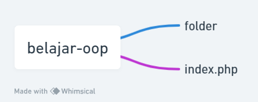
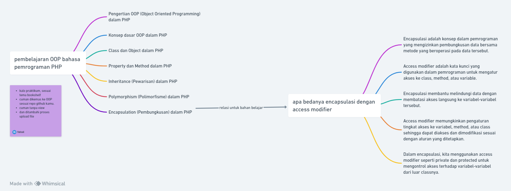

dalam pembuatan kode ini saya mempelajari dari video pak sandika galih.
untuk struktur dan lain2 saya customisasi sendiri

## struktur project
001-class dan object
002-construktor dan destruktor
003-inheritance
004-polimorphism
005-encapsulasi
006-abstraksi